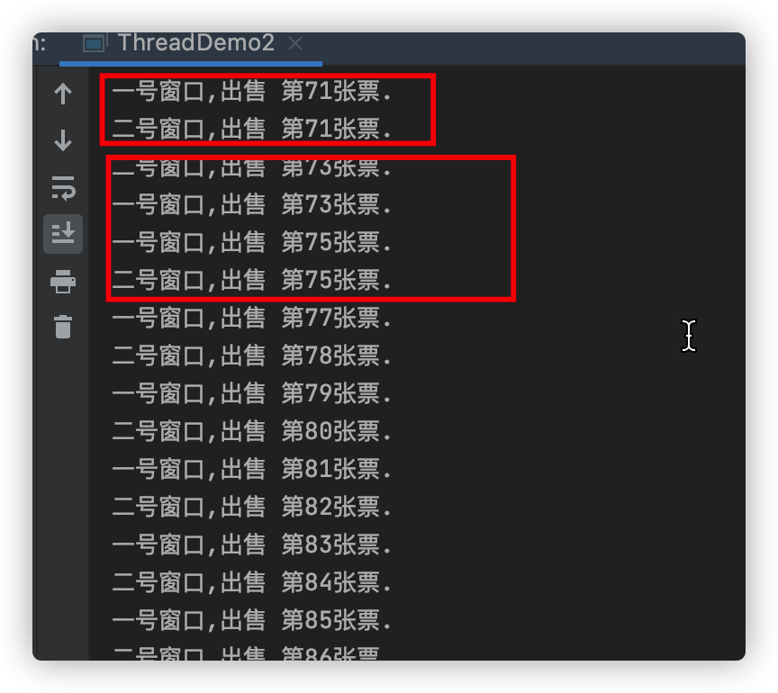

#  多线程之间实现同步
## 线程安全
当多个线程同时共享，同一个全局变量或静态变量，做写的操作时，可能会发生数据冲突问题，也就是线程安全问题。但是做读操作是不会发生数据冲突问题。

案例:需求现在有100张火车票，有两个窗口同时抢火车票，请使用多线程模拟抢票效果。
代码:com.thread.l2.ThreadDemo2
运行结果:

一号窗口和二号窗口同时出售火车第71、73...张,部分火车票会重复出售。
结论发现，多个线程共享同一个全局成员变量时，做写的操作可能会发生数据冲突问题。
## 线程安全解决办法:
1. 问:如何解决多线程之间线程安全问题?
答:使用多线程之间同步或使用锁(lock)。
2. 问:为什么使用线程同步或使用锁能解决线程安全问题呢？
答:将可能会发生数据冲突问题(线程不安全问题)，只能让当前一个线程进行执行。代码执行完成后释放锁，让后才能让其他线程进行执行。这样的话就可以解决线程不安全问题。
3. 问:什么是多线程之间同步？
答:当多个线程共享同一个资源,不会受到其他线程的干扰。
### 使用同步代码块
什么是同步代码块？
答:就是将可能会发生线程安全问题的代码，给包括起来。
synchronized(同一个数据){
 可能会发生线程冲突问题
}
      代码样例:

 ```
private Object mutex = new Object();// 自定义多线程同步锁
	public void sale() {
    synchronized (mutex) {
      if (trainCount > 0) {
        try {
          Thread.sleep(10);
        } catch (Exception e) {
        }
        System.out.println(Thread.currentThread().getName() + ",出售 第" + (100 - trainCount + 1) + "张票.");
        trainCount--;
      }
    }
  }
 ```

###  同步函数

   什么是同步函数？
   答：在方法上修饰synchronized 称为同步函数
 代码样例

```
public synchronized void sale() {
    if (trainCount > 0) {
      try {
        Thread.sleep(40);
      } catch (Exception e) {
      }
      System.out.println(Thread.currentThread().getName() + ",出售 第" + (100 - trainCount + 1) + "张票.");
      trainCount--;
    }
  }
```


同学们思考问题？同步函数用的是什么锁？
答：同步函数使用this锁。
证明方式: 一个线程使用同步代码块(this明锁),另一个线程使用同步函数。如果两个线程抢票不能实现同步，那么会出现数据错误。
代码:

	package com.thread.l2;
	
	public class ThreadTrain2 implements Runnable {
	  // 这是货票总票数,多个线程会同时共享资源
	  private int trainCount = 100;
	  public boolean flag = true;
	
	  @Override
	  public void run() {
	    if (flag) {
	      while (true) {
	        synchronized (this) {
	          if (trainCount > 0) {
	            try {
	              Thread.sleep(40);
	            } catch (Exception e) {
	
	            }
	            System.out.println(Thread.currentThread().getName() + ",出售 第" + (100 - trainCount + 1) + "张票.");
	            trainCount--;
	          }
	        }
	      }
	    } else {
	      while (true) {
	        sale();
	      }
	    }
	  }
	
	  public synchronized void sale() {
	    if (trainCount > 0) {
	      try {
	        Thread.sleep(40);
	      } catch (Exception e) {
	
	      }
	      System.out.println(Thread.currentThread().getName() + ",出售 第" + (100 - trainCount + 1) + "张票.");
	      trainCount--;
	    }
	  }
	}
	
	package com.thread.l2;
	
	public class ThreadDemo21 {
	  public static void main(String[] args) throws InterruptedException {
	    ThreadTrain2 threadTrain = new ThreadTrain2(); // 定义 一个实例
	    Thread thread1 = new Thread(threadTrain, "一号窗口");
	    Thread thread2 = new Thread(threadTrain, "二号窗口");
	    thread1.start();
	    Thread.sleep(40);
	    threadTrain.flag = false;
	    thread2.start();
	  }
	}
	

什么是静态同步函数？
答：方法上加上static关键字，使用synchronized 关键字修饰 或者使用类.class文件。
静态的同步函数使用的锁是  该函数所属字节码文件对象 
可以用 getClass方法获取，也可以用当前  类名.class 表示。
代码样例:

```
synchronized (ThreadTrain.class) {
			System.out.println(Thread.currentThread().getName() + ",出售 第" + (100 - trainCount + 1) + "张票.");
			trainCount--;
			try {
				Thread.sleep(100);
			} catch (Exception e) {
			}
}
```

总结：
synchronized 修饰方法使用锁是当前this锁。
synchronized 修饰静态方法使用锁是当前类的字节码文件

## 多线程死锁

  4.1、什么是多线程死锁？

  答:同步中嵌套同步,导致锁无法释放
 代码:

	package com.thread.l2;
	
	public class ThreadTrain3 implements Runnable {
	  // 这是货票总票数,多个线程会同时共享资源
	  private int trainCount = 100;
	  public boolean flag = true;
	  private Object mutex = new Object();
	
	  @Override
	  public void run() {
	    if (flag) {
	      while (true) {
	        synchronized (mutex) {
	          // 锁(同步代码块)在什么时候释放？ 代码执行完， 自动释放锁.
	          // 如果flag为true 先拿到 obj锁,在拿到this 锁、 才能执行。
	          // 如果flag为false先拿到this,在拿到obj锁，才能执行。
	          // 死锁解决办法:不要在同步中嵌套同步。
	          sale();
	        }
	      }
	    } else {
	      while (true) {
	        sale();
	      }
	    }
	  }
	
	  public synchronized void sale() {
	    synchronized (mutex) {
	      if (trainCount > 0) {
	        try {
	          Thread.sleep(40);
	        } catch (Exception e) {
	
	        }
	        System.out.println(Thread.currentThread().getName() + ",出售 第" + (100 - trainCount + 1) + "张票.");
	        trainCount--;
	      }
	    }
	  }
	}
	
	package com.thread.l2;
	
	public class DeadlockThread {
	  public static void main(String[] args) throws InterruptedException {
	
	    ThreadTrain3 threadTrain = new ThreadTrain3(); // 定义 一个实例
	    Thread thread1 = new Thread(threadTrain, "一号窗口");
	    Thread thread2 = new Thread(threadTrain, "二号窗口");
	    thread1.start();
	    Thread.sleep(40);
	    threadTrain.flag = false;
	    thread2.start();
	  }
	}
	


## 练习题

设计4个线程，其中两个线程每次对j增加1，另外两个线程对j每次减少1。写出程序。

## 提问

### 问:什么是多线程安全？

答:当多个线程同时共享，同一个全局变量或静态变量，做写的操作时，可能会发生数据冲突问题，也就是线程安全问题。做读操作是不会发生数据冲突问题。

### 问:如何解决多线程之间线程安全问题?

答:使用多线程之间同步或使用锁(lock)。

### 问:为什么使用线程同步或使用锁能解决线程安全问题呢？

答:将可能会发生数据冲突问题(线程不安全问题)，只能让当前一个线程进行执行。被包裹的代码执行完成后释放锁，让后才能让其他线程进行执行。这样的话就可以解决线程不安全问题。

### 问:什么是多线程之间同步？

答:当多个线程共享同一个资源,不会受到其他线程的干扰。

### 问:什么是同步代码块？

答:就是将可能会发生线程安全问题的代码，给包括起来。只能让当前一个线程进行执行，被包裹的代码执行完成之后才能释放所，让后才能让其他线程进行执行。

### 问:多线程同步的分类？

1. 使用同步代码块

```
synchronized(同一个数据){
可能会发生线程冲突问题
}
private Object mutex = new Object();// 自定义多线程同步锁
public void sale() {
synchronized (mutex) {
if (trainCount > 0) {
try {
Thread.sleep(10);
} catch (Exception e) {
}
System.out.println(Thread.currentThread().getName() + ",出售 第" + (100 - trainCount + 1) + "张票.");
trainCount--;			}
}
}
```

1. 使用同步函数

```
在方法上修饰synchronized 称为同步函数
public synchronized void sale() {
if (trainCount > 0) {
try {
Thread.sleep(40);
} catch (Exception e) {
}
System.out.println(Thread.currentThread().getName() + ",出售 第" + (100 - trainCount + 1) + "张票.");
trainCount--;
}
}
```

1. 静态同步函数

```
方法上加上static关键字，使用synchronized 关键字修饰 为静态同步函数
静态的同步函数使用的锁是  该函数所属字节码文件对象
```

### 问:同步代码块与同步函数区别？

答: 同步代码使用自定锁(明锁) 同步函数使用this锁

### 问:同步函数与静态同步函数区别?

注意:有些面试会这样问：例如现在一个静态方法和一个非静态静态怎么实现同步？ 答: 同步函数使用this锁 静态同步函数使用字节码文件，也就是类.class

### 问:什么是多线程死锁?

同步中嵌套同步 解决办法:同步中尽量不要嵌套同步


   
