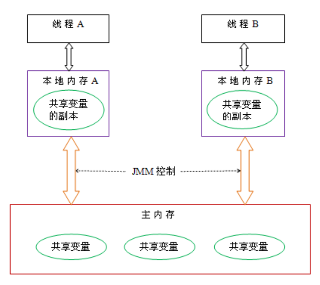
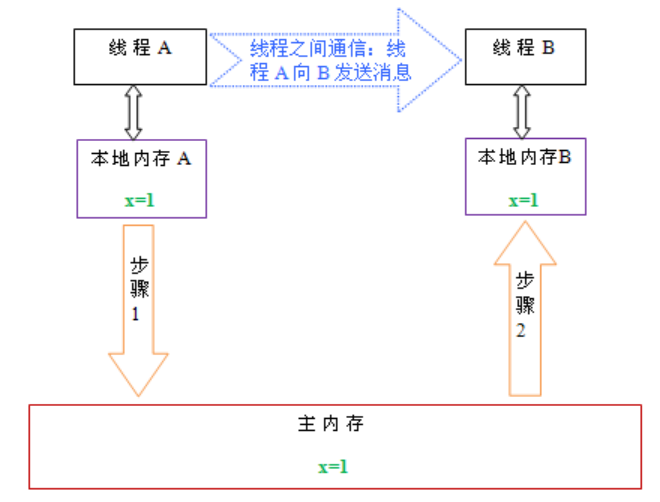
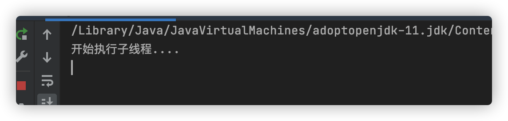
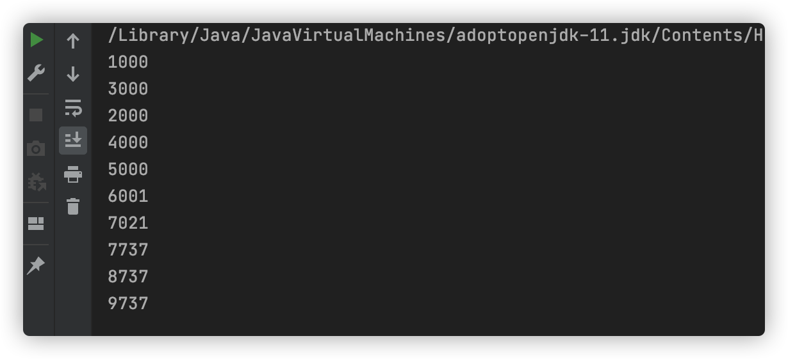

# Java多线程与并发编程
1. 多线程三大特性
2. Java内存模型
3. Volatile
4. ThreadLocal
5. 线程池
## 线程三大特性
多线程有三大特性，原子性、可见性、有序性
### 什么是原子性
即一个操作或者多个操作 要么全部执行并且执行的过程不会被任何因素打断，要么就都不执行。
一个很经典的例子就是银行账户转账问题：
比如从账户A向账户B转1000元，那么必然包括2个操作：从账户A减去1000元，往账户B加上1000元。这2个操作必须要具备原子性才能保证不出现一些意外的问题。
我们操作数据也是如此，比如i = i+1；其中就包括，读取i的值，计算i，写入i。这行代码在Java中是不具备原子性的，则多线程运行肯定会出问题，所以也需要我们使用同步和lock这些东西来确保这个特性了。
原子性其实就是保证数据一致、线程安全一部分，
### 什么是可见性
当多个线程访问同一个变量时，一个线程修改了这个变量的值，其他线程能够立即看得到修改的值。
若两个线程在不同的cpu，那么线程1改变了i的值还没刷新到主存，线程2又使用了i，那么这个i值肯定还是之前的，线程1对变量的修改线程没看到这就是可见性问题。
### 什么是有序性
程序执行的顺序按照代码的先后顺序执行。
一般来说处理器为了提高程序运行效率，可能会对输入代码进行优化，它不保证程序中各个语句的执行先后顺序同代码中的顺序一致，但是它会保证程序最终执行结果和代码顺序执行的结果是一致的。如下：
```
int a = 10;    //语句1
int r = 2;    //语句2
a = a + 3;    //语句3
r = a*a;     //语句4
```
则因为重排序，他还可能执行顺序为 2-1-3-4，1-3-2-4
但绝不可能 2-1-4-3，因为这打破了依赖关系。
显然重排序对单线程运行是不会有任何问题，而多线程就不一定了，所以我们在多线程编程时就得考虑这个问题了。
## Java内存模型
共享内存模型指的就是Java内存模型(简称JMM)，JMM决定一个线程对共享变量的写入时,能对另一个线程可见。从抽象的角度来看，JMM定义了线程和主内存之间的抽象关系：线程之间的共享变量存储在主内存（main memory）中，每个线程都有一个私有的本地内存（local memory），本地内存中存储了该线程以读/写共享变量的副本。本地内存是JMM的一个抽象概念，并不真实存在。它涵盖了缓存，写缓冲区，寄存器以及其他的硬件和编译器优化。

从上图来看，线程A与线程B之间如要通信的话，必须要经历下面2个步骤：
1. 首先，线程A把本地内存A中更新过的共享变量刷新到主内存中去。
2. 然后，线程B到主内存中去读取线程A之前已更新过的共享变量。
下面通过示意图来说明这两个步骤：

如上图所示，本地内存A和B有主内存中共享变量x的副本。假设初始时，这三个内存中的x值都为0。线程A在执行时，把更新后的x值（假设值为1）临时存放在自己的本地内存A中。当线程A和线程B需要通信时，线程A首先会把自己本地内存中修改后的x值刷新到主内存中，此时主内存中的x值变为了1。随后，线程B到主内存中去读取线程A更新后的x值，此时线程B的本地内存的x值也变为了1。
从整体来看，这两个步骤实质上是线程A在向线程B发送消息，而且这个通信过程必须要经过主内存。JMM通过控制主内存与每个线程的本地内存之间的交互，来为java程序员提供内存可见性保证。  
**总结：什么是Java内存模型：java内存模型简称jmm，定义了一个线程对另一个线程可见。共享变量存放在主内存中，每个线程都有自己的本地内存，当多个线程同时访问一个数据的时候，可能本地内存没有及时刷新到主内存，所以就会发生线程安全问题。**
## Volatile
### 什么是Volatile
Volatile 关键字的作用是变量在多个线程之间可见。
代码:
```aidl
package com.thread;

public class ThreadVolatileDemo extends Thread {
  public boolean flag = true;
  //public volatile boolean flag = true;
  @Override
  public void run() {
    System.out.println("开始执行子线程....");
    while (flag) {
    }
    System.out.println("线程停止");
  }

  public void setRuning(boolean flag) {
    this.flag = flag;
  }
}

package com.thread;

public class ThreadVolatile {
  public static void main(String[] args) throws InterruptedException {
    ThreadVolatileDemo threadVolatileDemo = new ThreadVolatileDemo();
    threadVolatileDemo.start();
    Thread.sleep(3000);
    threadVolatileDemo.setRuning(false);
    System.out.println("flag 已经设置成false");
    Thread.sleep(1000);
    System.out.println(threadVolatileDemo.flag);
  }
}
```
运行结果:

已经将结果设置为fasle为什么？还一直在运行呢。
原因:线程之间是不可见的，读取的是副本，没有及时读取到主内存结果。
解决办法使用Volatile关键字将解决线程之间可见性, 强制线程每次读取该值的时候都去“主内存”中取值
```  
public volatile boolean flag = true;
```
### Volatile非原子性
```aidl
package com.thread;

public class VolatileNoAtomic extends Thread {
  private static volatile int count;

  // private static AtomicInteger count = new AtomicInteger(0);
  private static void addCount() {
    for (int i = 0; i < 1000; i++) {
      count++;
      // count.incrementAndGet();
    }
    System.out.println(count);
  }

  public void run() {
    addCount();
  }

  public static void main(String[] args) {

    VolatileNoAtomic[] arr = new VolatileNoAtomic[100];
    for (int i = 0; i < 10; i++) {
      arr[i] = new VolatileNoAtomic();
    }

    for (int i = 0; i < 10; i++) {
      arr[i].start();
    }
  }
}
```
运行结果:

结果发现 数据不同步，因为Volatile不用具备原子性。
### 使用AtomicInteger原子类
```
package com.thread4;

import java.util.concurrent.atomic.AtomicInteger;

public class VolatileAndAtomic extends Thread {
  static int count = 0;
  private static AtomicInteger atomicInteger = new AtomicInteger(0);

  @Override
  public void run() {
    for (int i = 0; i < 1000; i++) {
      //等同于i++
      atomicInteger.incrementAndGet();
    }
    System.out.println(count);
  }

  public static void main(String[] args) {
    // 初始化10个线程
    VolatileNoAtomic[] volatileNoAtomic = new VolatileNoAtomic[10];
    for (int i = 0; i < 10; i++) {
      // 创建
      volatileNoAtomic[i] = new VolatileNoAtomic();
    }
    for (int i = 0; i < volatileNoAtomic.length; i++) {
      volatileNoAtomic[i].start();
    }
  }
}
```
### volatile与synchronized区别
仅靠volatile不能保证线程的安全性。（原子性）
①volatile轻量级，只能修饰变量。synchronized重量级，还可修饰方法  
②volatile只能保证数据的可见性，不能用来同步，因为多个线程并发访问volatile修饰的变量不会阻塞。
synchronized不仅保证可见性，而且还保证原子性，因为，只有获得了锁的线程才能进入临界区，从而保证临界区中的所有语句都全部执行。多个线程争抢synchronized锁对象时，会出现阻塞。
### 线程安全性
线程安全性包括两个方面，①可见性。②原子性。
从上面自增的例子中可以看出：仅仅使用volatile并不能保证线程安全性。而synchronized则可实现线程的安全性。
## ThreadLoca
### 什么是ThreadLoca
ThreadLocal提高一个线程的局部变量，访问某个线程拥有自己局部变量。
当使用ThreadLocal维护变量时，ThreadLocal为每个使用该变量的线程提供独立的变量副本，所以每一个线程都可以独立地改变自己的副本，而不会影响其它线程所对应的副本。
ThreadLocal的接口方法
ThreadLocal类接口很简单，只有4个方法，我们先来了解一下：
```
void set(Object value)设置当前线程的线程局部变量的值。
public Object get()该方法返回当前线程所对应的线程局部变量。
public void remove()将当前线程局部变量的值删除，目的是为了减少内存的占用，该方法是JDK 5.0新增的方法。需要指出的是，当线程结束后，对应该线程的局部变量将自动被垃圾回收，所以显式调用该方法清除线程的局部变量并不是必须的操作，但它可以加快内存回收的速度。
protected Object initialValue()返回该线程局部变量的初始值，该方法是一个protected的方法，显然是为了让子类覆盖而设计的。这个方法是一个延迟调用方法，在线程第1次调用get()或set(Object)时才执行，并且仅执行1次。ThreadLocal中的缺省实现直接返回一个null。
```
案例:创建三个线程，每个线程生成自己独立序列号。
代码:
```aidl
package com.thread4;

public class Res {
  // 生成序列号共享变量
  public static Integer count = 0;
  public static ThreadLocal<Integer> threadLocal = new ThreadLocal<Integer>() {
    protected Integer initialValue() {
      return 0;
    }
  };

  public Integer getNum() {
    int count = threadLocal.get() + 1;
    threadLocal.set(count);
    return count;
  }
}

package com.thread4;

public class ThreadLocaDemo2 extends Thread {
  private Res res;

  public ThreadLocaDemo2(Res res) {
    this.res = res;
  }

  @Override
  public void run() {
    for (int i = 0; i < 3; i++) {
      System.out.println(Thread.currentThread().getName() + "---" + "i---" + i + "--num:" + res.getNum());
    }
  }

  public static void main(String[] args) {
    Res res = new Res();
    ThreadLocaDemo2 threadLocaDemo1 = new ThreadLocaDemo2(res);
    ThreadLocaDemo2 threadLocaDemo2 = new ThreadLocaDemo2(res);
    ThreadLocaDemo2 threadLocaDemo3 = new ThreadLocaDemo2(res);
    threadLocaDemo1.start();
    threadLocaDemo2.start();
    threadLocaDemo3.start();
  }

}
```
### ThreadLoca实现原理
ThreadLoca通过map集合
Map.put(“当前线程”,值)；

## 线程池
### 什么是线程池？
线程池是指在初始化一个多线程应用程序过程中创建一个线程集合，然后在需要执行新的任务时重用这些线程而不是新建一个线程。线程池中线程的数量通常完全取决于可用内存数量和应用程序的需求。然而，增加可用线程数量是可能的。线程池中的每个线程都有被分配一个任务，一旦任务已经完成了，线程回到池子中并等待下一次分配任务。
### 线程池作用
基于以下几个原因在多线程应用程序中使用线程是必须的：
1. 线程池改进了一个应用程序的响应时间。由于线程池中的线程已经准备好且等待被分配任务，应用程序可以直接拿来使用而不用新建一个线程。
2. 线程池节省了CLR 为每个短生存周期任务创建一个完整的线程的开销并可以在任务完成后回收资源。
3. 线程池根据当前在系统中运行的进程来优化线程时间片。
4. 线程池允许我们开启多个任务而不用为每个线程设置属性。
5. 线程池允许我们为正在执行的任务的程序参数传递一个包含状态信息的对象引用。
6. 线程池可以用来解决处理一个特定请求最大线程数量限制问题。
### 线程池四种创建方式
Java通过Executors（jdk1.5并发包）提供四种线程池，分别为：
```aidl
newCachedThreadPool创建一个可缓存线程池，如果线程池长度超过处理需要，可灵活回收空闲线程，若无可回收，则新建线程。
newFixedThreadPool 创建一个定长线程池，可控制线程最大并发数，超出的线程会在队列中等待。
newScheduledThreadPool 创建一个定长线程池，支持定时及周期性任务执行。
newSingleThreadExecutor 创建一个单线程化的线程池，它只会用唯一的工作线程来执行任务，保证所有任务按照指定顺序(FIFO, LIFO, 优先级)执行。
```
#### newCachedThreadPool
创建一个可缓存线程池，如果线程池长度超过处理需要，可灵活回收空闲线程，若无可回收，则新建线程。示例代码如下：
```aidl
package com.thread4;

import java.util.concurrent.ExecutorService;
import java.util.concurrent.Executors;

public class CachedThreadPoolDemo {
  public static void main(String[] args) {
    ExecutorService cachedThreadPool = Executors.newCachedThreadPool();
    for (int i = 0; i < 10; i++) {
      final int index = i;
// try {
// Thread.sleep(index * 1000);
// } catch (InterruptedException e) {
// e.printStackTrace();
// }
      cachedThreadPool.execute(new Runnable() {
        public void run() {
          System.out.println(Thread.currentThread().getName() + "---" + index);
        }
      });
    }
  }
}
```
**总结: 线程池为无限大，当执行第二个任务时第一个任务已经完成，会复用执行第一个任务的线程，而不用每次新建线程。**
#### newFixedThreadPool
创建一个定长线程池，可控制线程最大并发数，超出的线程会在队列中等待。示例代码如下：
```aidl
package com.thread4;

import java.util.concurrent.ExecutorService;
import java.util.concurrent.Executors;

public class FixedThreadPoolDemo {
  public static void main(String[] args) {
    // 创建一个定长线程池，可控制线程最大并发数，超出的线程会在队列中等待
    final ExecutorService newCachedThreadPool = Executors.newFixedThreadPool(3);
    for (int i = 0; i < 10; i++) {
      final int index = i;
      newCachedThreadPool.execute(new Runnable() {
        public void run() {
          try {
            Thread.sleep(1000);
          } catch (Exception e) {
            // TODO: handle exception
          }
          System.out.println("i:" + index);
        }
      });
    }
  }
}
```
总结:因为线程池大小为3，每个任务输出index后sleep 2秒，所以每两秒打印3个数字。
定长线程池的大小最好根据系统资源进行设置。如Runtime.getRuntime().availableProcessors()
#### newScheduledThreadPool
创建一个定长线程池，支持定时及周期性任务执行。延迟执行示例代码如下：
```aidl
package com.thread4;

import java.util.concurrent.Executors;
import java.util.concurrent.ScheduledExecutorService;
import java.util.concurrent.TimeUnit;

public class ScheduledThreadPoolDemo {
  public static void main(String[] args) {
  // 创建一个定长线程池，支持定时及周期性任务执行。延迟执行
    ScheduledExecutorService newScheduledThreadPool = Executors.newScheduledThreadPool(5);
    newScheduledThreadPool.schedule(new Runnable() {
      public void run() {
        System.out.println("delay 3 seconds");
      }
    }, 3, TimeUnit.SECONDS);
  }
}
```
表示延迟3秒执行。
#### newSingleThreadExecutor
创建一个单线程化的线程池，它只会用唯一的工作线程来执行任务，保证所有任务按照指定顺序(FIFO, LIFO, 优先级)执行。示例代码如下：
```aidl
package com.thread4;

import java.util.concurrent.ExecutorService;
import java.util.concurrent.Executors;

public class SingleThreadExecutorDemo {
  public static void main(String[] args) {
    ExecutorService newSingleThreadExecutor = Executors.newSingleThreadExecutor();
    for (int i = 0; i < 10; i++) {
      final int index = i;
      newSingleThreadExecutor.execute(new Runnable() {
        @Override
        public void run() {
          System.out.println("index:" + index);
          try {
            Thread.sleep(200);
          } catch (Exception e) {
            // TODO: handle exception
          }
        }
      });
    }
  }
}
```
注意: 结果依次输出，相当于顺序执行各个任务。
