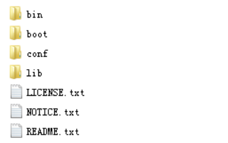
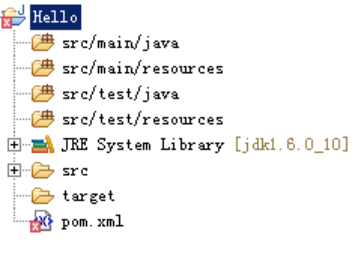
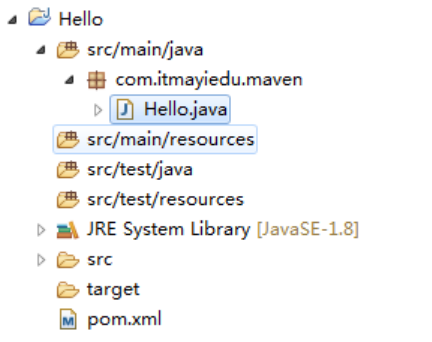
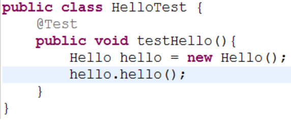
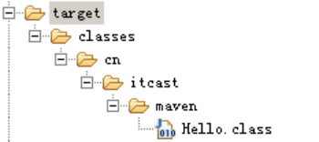

# maven
构建Maven多模块功能
## 什么是maven
Maven是一个跨平台的项目管理工具，主要用于基于java平台的项目构建，依赖管理。

如图为项目构建的过程。
解决的项目的问题：
1、如果有好几个项目，这好几个项目中，需要用到很多相同的jar包，能不能只建立一个仓库来解决这个问题？
2、测试方法能不能全部运行呢？
3、怎么样把一个模块的功能放入到仓库中
## Maven的安装与配置
Maven的安装
Jdk的情况
Jdk必须1.6以上的版本
从官网下载maven
从http://maven.apache.org/官网上下载最新版本的maven
设定path路径
把下载下来的maven解压缩，然后有一个bin文件夹，这是一个bin的文件夹的目录
F:\work\course\maven\maven\bin
把该目录追加到环境变量的path中。
利用命令行检查是否成功

有这个图，说明maven安装成功了。
建库
先打开路径
C:\Users\Think\.m2
把settings.xml文件复制到上述的路径中
F:\work\course\maven\apache-maven-3.0.5-bin\apache-maven-3.0.5\conf
有一个settings.xml文件，复制到C:\Users\Think\.m2
修改settings.xml文件
<localRepository>F:/work/course/maven/mavenRepository/</localRepository>
指定仓库的路径

在这里mavenRepository就是仓库的路径
Maven的配置

说明：
bin中存放可执行的二进制文件
conf存放settings.xml文件
lib  运行maven所依赖的jar包
maven的约定
src/main/java      存放项目的java文件
src/main/resources  存放项目的资源文件，如spring，hibernate的配置文件
src/test/java       存放所有的测试的java文件
src/test/resources   存放测试用的资源文件
target            项目输出位置
pom.xml  文件
## maven项目
hello项目
在eclipse建立一个项目Hello

创建一个包cn.itmayiedu.maven，并在该包下创建一个类

编写Hello类

在src/test/java中创建一个包cn.itcast.maven，创建一个测试类HelloTest

编写测试类

编辑pom.xml文件
```aidl
<project xmlns="http://maven.apache.org/POM/4.0.0"
xmlns:xsi="http://www.w3.org/2001/XMLSchema-instance"
xsi:schemaLocation="http://maven.apache.org/POM/4.0.0
http://maven.apache.org/xsd/maven-4.0.0.xsd">
<modelVersion>4.0.0</modelVersion>
<groupId>com.itmayiedu</groupId>
<artifactId>Hello</artifactId>
<version>1.0</version>
</project>
```
groupId	这是项目组的编号，这在组织或项目中通常是独一无二的。
artifactId	这是项目的ID。这通常是项目的名称。 例如，consumer-banking。 除了groupId之外，artifactId还定义了artifact在存储库中的位置。
version	这是项目的版本。与groupId一起使用，artifact在存储库中用于将版本彼此分离。
说明：
project：表示一个工程
modelVersion：为版本号
### 用maven命令编译项目(mvn compile)

target文件夹的变化

可以看到编译后的文件全部放入到了target里。
### clean
执行命令mvn clean


说明执行成功了。


可以看到target的目录没有了。
### test
执行mvn test命令


说明执行成功了，并且运行了一个类，再次看target的结构


说明：
target/classes
存放编译后的类
target/test-classes
存放编译后的测试类
target/surefire-reports
存放测试报告
可以看出，只要进行测试，清理和编译可以自动执行了。
### package
执行mvn package


	这个界面说明打包成功了。

	

	说明：
		target/classes
             编译后的类的路径
        target/test-classes
             编译后的测试类的路径
        target/surefire-reports
             测试报告
        target/maven-archiver
             执行package的归档
        Hello-0.0.1-SNAPSHOT.jar
			 执行完package命令后打成的jar包
Hellofriend项目
建立HelloFriend项目工程

编写pom.xml文件
```aidl
<project xmlns="http://maven.apache.org/POM/4.0.0" xmlns:xsi="http://www.w3.org/2001/XMLSchema-instance"
xsi:schemaLocation="http://maven.apache.org/POM/4.0.0 http://maven.apache.org/xsd/maven-4.0.0.xsd">

	<modelVersion>4.0.0</modelVersion>
	<!-- 属于那些分组,一般以公司名称名称开头 -->
	<groupId>com.itmayiedu</groupId>
	<!-- 一般为项目名称 -->
	<artifactId>Hellofriend</artifactId>
	<version>0.0.1</version>
	<dependencies>
		<dependency>
			<!-- 属于那些分组,一般以公司名称名称开头 -->
			<groupId>com.itmayiedu</groupId>
			<!-- 一般为项目名称 -->
			<artifactId>Hello</artifactId>
			<version>0.0.1</version>
		</dependency>
	</dependencies>
</project>
```

执行mvn compile命令
执行这个命令的时候会出错，因为HelloFriend项目是建立在Hello项目基础之上的，但是现在工程中没有引入Hello.java这个类。所以会出错。
执行mvn clean install命令
1、打开命令行
2、把当前路径调节到Hello工程的根目录
3、执行mvn clean install命令，把Hello整个工程放入到仓库中


如果执行成功，则会在仓库中看到。


在仓库中的位置。
执行mvn package命令打包HelloFriend工程

说明成功了。


可以看到成功以后，在target目录下多了一个jar包
该jar包为当前工程的jar包。
建立cn.itcast.maven包及HelloFriend类

编辑HelloFriend类

建立cn.itcast.maven包和测试类HelloFriendTest类

编辑HelloFriendTest类

执行mvn package命令


上图中的”say hello”就是输出的结果。
五、maven的核心概念
项目对象模型

说明：
maven根据pom.xml文件，把它转化成项目对象模型(POM)，这个时候要解析依赖关系，然后去相对应的maven库中查找到依赖的jar包。
在clean，compile，test，package等阶段都有相应的Plug-in来做这些事情。
而这些plug-in会产生一些中间产物。
插件的位置
在maven解压后的位置F:\work\course\maven\maven有一个bin文件夹，里面有
一个文件m2.config文件
set maven.home default ${user.home}/m2，其中该路径指明了仓库的存储位置。

其中settings.xml文件中

这个说明了仓库中的位置。
这里的插件就是执行maven的各种命令所需要的插件。
maven坐标
maven坐标的主要组成
groupId：定义当前maven项目属于哪个项目
artifactId：定义实际项目中的某一个模块
version：定义当前项目的当前版本
packaging：定义当前项目的打包方式

根据这些坐标，在maven库中可以找到唯一的jar包
依赖管理
继承管理

创建一个项目HelloParent
```aidl
<project xmlns="http://maven.apache.org/POM/4.0.0" xmlns:xsi="http://www.w3.org/2001/XMLSchema-instance"
xsi:schemaLocation="http://maven.apache.org/POM/4.0.0 http://maven.apache.org/xsd/maven-4.0.0.xsd">

	<modelVersion>4.0.0</modelVersion>
	<!-- 属于那些分组,一般以公司名称名称开头 -->
	<groupId>com.itmayiedu</groupId>
	<!-- 一般为项目名称 -->
	<artifactId>HelloParent</artifactId>
	<version>0.0.1</version>
	<packaging>pom</packaging>
	<dependencies>
		<dependency>
			<!-- 属于那些分组,一般以公司名称名称开头 -->
			<groupId>com.itmayiedu</groupId>
			<!-- 一般为项目名称 -->
			<artifactId>Hello</artifactId>
			<version>0.0.1</version>
		</dependency>
	</dependencies>
</project>
```
Hellofriend、Hello项目继承HelloParent
仓库管理
可以根据maven坐标定义每一个jar包在仓库中的存储位置。
大致为：groupId/artifactId/version/artifactId-version.packaging
仓库的分类
本地仓库
~/.m2/repository/
每一个用户也可以拥有一个本地仓库
远程仓库
中央仓库：Maven默认的远程仓库
http://repo1.maven.org/maven2
私服：是一种特殊的远程仓库，它是架设在局域网内的仓库
镜像：用来替代中央仓库，速度一般比中央仓库快

## maven在eclipse中的应用
环境配置
如果所示，myeclipse自带maven，从上图看以看到Maven JDK是可以配置的，这里用了jdk1.6
从上图可以看出，我们可以利用myeclipse自带的maven，也可以使用自己的maven。
上图应用的就是自己的maven。

从最下面可以看出，这是settings.xml文件的路径。
这幅图说明了用户的settings.xml文件的位置和用户的仓库的位置。
这是最基本的环境的配置。
settings.xml文件
仓库的路径

通过配置localRepository的值可以改变仓库的路径。
配置私服的路径
直接连接互联网
如果不想连接私服，可以直接连接互联网。只需要把连接私服的所有的路径去掉即可。
创建maven工程
创建java project
选择Maven Project
选择快速创建maven-archetype-quickstart
填写group ID，Artiface Id，Version，Package属性
然后点击finish就可以了。

创建web project
新创建一个web project
添加maven support即可。
## 使用Maven建立（聚合）多模块功能
目录结构
----- itmayiedu-parent-----父工程
----- itmayiedu-service-----业务逻辑层
----- itmayiedu-web-----web层
构建itmayiedu-parent
```aidl
<project xmlns="http://maven.apache.org/POM/4.0.0" xmlns:xsi="http://www.w3.org/2001/XMLSchema-instance"
xsi:schemaLocation="http://maven.apache.org/POM/4.0.0 http://maven.apache.org/xsd/maven-4.0.0.xsd">
<modelVersion>4.0.0</modelVersion>
<groupId>com.itmayiedu</groupId>
<artifactId>itmayiedu-parent</artifactId>
<version>0.0.1-SNAPSHOT</version>
<packaging>pom</packaging>
<dependencies>
<!-- https://mvnrepository.com/artifact/commons-lang/commons-lang -->
<dependency>
<groupId>commons-lang</groupId>
<artifactId>commons-lang</artifactId>
<version>2.6</version>
</dependency>
</dependencies>
<modules>
<module>../itmayiedu-service</module>
<module>../itmayiedu-web</module>
</modules>
</project>
构建itmayiedu-service
<project xmlns="http://maven.apache.org/POM/4.0.0" xmlns:xsi="http://www.w3.org/2001/XMLSchema-instance"
xsi:schemaLocation="http://maven.apache.org/POM/4.0.0 http://maven.apache.org/xsd/maven-4.0.0.xsd">
<modelVersion>4.0.0</modelVersion>
<parent>
<groupId>com.itmayiedu</groupId>
<artifactId>itmayiedu-parent</artifactId>
<version>0.0.1-SNAPSHOT</version>
<relativePath>../itmayiedu-parent/pom.xml</relativePath>
</parent>
<groupId>com.itmayiedu</groupId>
<artifactId>itmayiedu-service</artifactId>
<version>0.0.1-SNAPSHOT</version>
</project>
```
构建itmayiedu-web
```aidl
<project xmlns="http://maven.apache.org/POM/4.0.0" xmlns:xsi="http://www.w3.org/2001/XMLSchema-instance"
xsi:schemaLocation="http://maven.apache.org/POM/4.0.0 http://maven.apache.org/xsd/maven-4.0.0.xsd">
<modelVersion>4.0.0</modelVersion>
<parent>
<groupId>com.itmayiedu</groupId>
<artifactId>itmayiedu-parent</artifactId>
<version>0.0.1-SNAPSHOT</version>
<relativePath>../itmayiedu-parent/pom.xml</relativePath>
</parent>
<groupId>com.itmayiedu</groupId>
<artifactId>itmayiedu-web</artifactId>
<version>0.0.1-SNAPSHOT</version>
<packaging>war</packaging>

	<dependencies>
		<dependency>
			<groupId>com.itmayiedu</groupId>
			<artifactId>itmayiedu-service</artifactId>
			<version>0.0.1-SNAPSHOT</version>
		</dependency>
		<!-- https://mvnrepository.com/artifact/javax.servlet/javax.servlet-api -->
		<dependency>
			<groupId>javax.servlet</groupId>
			<artifactId>javax.servlet-api</artifactId>
			<version>3.1.0</version>
		</dependency>
	</dependencies>

</project>
```
启动方式
添加tomat启动即可。
## Maven打包原理

### Maven中央存储库
当你建立一个 Maven 的项目，Maven 会检查你的 pom.xml 文件，以确定哪些依赖下载。首先，Maven 将从本地资源库获得 Maven 的本地资源库依赖资源，如果没有找到，然后把它会从默认的 Maven 中央存储库  http://search.maven.org/  查找下载。
在Maven中，当你声明的库不存在于本地存储库中，也没有不存在于Maven中心储存库，该过程将停止并将错误消息输出到 Maven 控制台。

### 添加远程仓库
默认情况下，Maven从Maven中央仓库下载所有依赖关系。但是，有些库丢失在中央存储库，只有在Java.net或JBoss的储存库远程仓库中能找到。
现在，Maven的依赖库查询顺序更改为：
在 Maven 本地资源库中搜索，如果没有找到，进入下一步，否则退出。
在 Maven 中央存储库搜索，如果没有找到，进入下一步，否则退出。
在Maven的远程存储库搜索，如果没有找到，提示错误信息，否则退出。
讲师画图
## 常用错误
错误原因①:
pom.xml报错：web.xml is missing and <failOnMissingWebXml> is set to true
解决办法:
出现这个错误的原因是Maven不支持缺少web.xml的web项目
添加Web模块，对项目右键->Java EE Tools->Generate Deployment Descriptor Stub,这样就在
src\main\webapp下面生成了WEB-INF文件夹和web.xml,问题解决.
错误原因②
'parent.relativePath' and 'parent.relativePath' points at wrong local POM @ line 4, column 10
解决办法
在应用parent工程中加上<relativePath>../itmayiedu-parent/pom.xml</relativePath>

<parent>
		<groupId>com.itmayiedu</groupId>
		<artifactId>itmayiedu-parent</artifactId>
		<version>0.0.1-SNAPSHOT</version>
		<relativePath>../itmayiedu-parent/pom.xml</relativePath>
	</parent>
错误原因③
No compiler is provided in this environment. Perhaps you are running on a JRE rather than a JDK?
解决办法 更换为自己本地的jdk即可。
